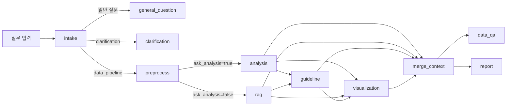

# AI Agent 실행 흐름

## 문서 목적

이 문서는 현재 프로젝트에서 AI Agent가 질문을 받아 어떤 단계와 분기를 거쳐 결과를 만드는지 설명한다.
현재 구현 기준의 orchestration 흐름을 바탕으로 정리하며, 기획, 프론트엔드, 백엔드가 함께 참고할 수 있도록 쉬운 언어로 설명한다.

## AI Agent 실행 흐름 개요

현재 AI Agent의 실행 흐름은 단순한 직선형 파이프라인이 아니다.
질문이 들어오면 초기 상태를 만들고, 데이터셋 유무에 따라 경로를 나눈 뒤, 현재 브랜치에서는 별도의 planner node 없이 intake가 coarse intent를 만들고 그 결과에 따라 전처리, 분석, 설명형 질의응답, 시각화, 리포트 경로를 조합한다.

또한 이 흐름은 중간에 승인 대기와 resume을 포함한다.
따라서 AI Agent 실행은 한 번에 끝나는 호출이라기보다, 필요 시 멈췄다가 다시 이어지는 workflow 기반 실행으로 이해하는 것이 맞다.

## 실행 시작과 초기 상태 구성

AI Agent 실행은 채팅 요청에서 시작된다.
이때 AgentClient는 질문을 workflow에 넘기기 전에 실행에 필요한 초기 상태를 만든다.

초기 상태에는 주로 아래 정보가 들어간다.

- 사용자 질문
- request context
- session_id
- run_id
- model_id
- source_id

이 단계의 목적은 “실행에 필요한 최소 정보 정리”다.
아직 planner나 분석이 시작되는 단계는 아니며, 질문이 비어 있으면 이 시점에서 바로 종료될 수도 있다.

## 컨텍스트 준비 단계

초기 상태가 준비되면 AI Agent는 질문을 바로 분석하지 않는다.
먼저 intake 단계에서 이 질문이 일반 질문인지, clarification이 필요한지, 데이터 파이프라인으로 들어가야 하는지를 정한다.

### 1. 최상위 분기

가장 먼저 질문은 아래 두 경로 중 하나로 갈린다.

- `general_question`
- `clarification`
- `dataset_selected`

데이터셋이 없는 질문은 일반 질문 경로로 바로 이어질 수 있다.
데이터셋이 있는 질문만 이후의 데이터 기반 준비 단계로 넘어간다.

### 2. 데이터셋 기반 분기

데이터셋 기반 질문은 별도 planner를 거치지 않고 아래 순서로 흐른다.

1. `preprocess_flow`
2. `analysis_flow` 또는 `rag_flow`
3. 필요 시 `guideline_flow`
4. 필요 시 `visualization_flow`
5. `merge_context`

`preprocess_flow`는 모든 selected-dataset 요청이 먼저 지나가는 단계다.
그 뒤 `handoff.ask_analysis`에 따라 analysis 또는 rag로 나뉜다.
guideline은 초기 분기 입력이 아니라 analysis/rag 이후의 보조 단계로 실행될 수 있다.

즉, 이 구간은 답변 생성 단계가 아니라 실행 판단을 위한 컨텍스트 준비 단계다.

## Intake + handoff 판단 단계

현재 구현 기준으로는 planner node 대신 intake가 핵심 최상위 분기 지점이다.
intake 이후에는 아래 경로가 실제로 존재한다.

- `general_question`
- `clarification`
- `data_pipeline`

각 경로의 의미는 아래와 같다.

- `general_question`: 데이터셋 없이도 답할 수 있는 일반 질의응답
- `clarification`: 질문이 모호해 사용자에게 추가 질문을 다시 보내야 하는 경우
- `data_pipeline`: selected-dataset 요청이 preprocess/analysis/rag/visualization/report 경로로 이어지는 경우

이 단계에서 중요한 점은, 현재 브랜치가 질문을 planner의 세밀한 route로 나누기보다 `handoff.ask_*` 플래그 기반으로 후속 흐름을 정한다는 것이다.

## 실행 분기 단계

planner 이후에는 각 workflow가 실제 실행을 담당한다.

### 1. Preprocess 흐름

selected-dataset 요청은 먼저 preprocess 단계로 들어간다.
여기서 시스템은 전처리 계획이 필요한지 판단한다.
이후 사용자의 승인 여부에 따라 실행, 수정, 취소로 갈린다.

전처리가 승인되면 실제 전처리가 수행되고, 이후 흐름은 다시 분석 단계로 이어진다.
취소되면 해당 실행은 더 진행되지 않는다.

### 2. Analysis 흐름

`analysis` 경로는 정량 분석 중심의 실행 흐름이다.
질문에 맞는 분석 계획을 만들고, 필요 시 코드 실행 기반으로 결과를 생성한다.

이 과정에서 결과가 바로 다음 단계로 이어질 수도 있고, clarification 또는 실패로 다시 빠질 수도 있다.
즉, analysis는 항상 성공적으로 끝나는 고정 단계가 아니라, 중간 판단과 실패 가능성을 함께 가진 실행 단계다.

### 3. RAG 흐름

`rag` 경로는 데이터 설명형 질의응답이나 검색 기반 설명이 필요한 경우에 사용된다.
정량 계산보다는 데이터 내용 설명이나 검색 기반 설명 같은 상황에 가깝다.

### 4. Visualization 흐름

시각화는 `analysis` 뒤에도 갈 수 있고 `rag` 뒤에도 갈 수 있으며, guideline 뒤에서 이어질 수도 있다.
즉, 시각화는 분석 전용 보조 단계가 아니라, 데이터 기반 결과를 더 잘 이해할 수 있도록 돕는 출력 workflow다.

### 5. Merge Context 단계

시각화 여부와 별개로, 중간 결과들은 `merge_context` 단계에서 다시 한 번 모인다.
이 단계는 최종 출력 직전의 조합 단계이며, 이후 `data_qa` 또는 `report` 경로로 이어질 준비를 한다.

## 승인과 재개 흐름

현재 AI Agent 실행은 한 번에 끝나는 구조가 아니라, 중간에 사용자 승인을 기다릴 수 있다.
대표적인 승인 단계는 아래 세 가지다.

- 전처리
- 시각화
- 리포트

각 단계에서 시스템은 계획이나 초안을 제시하고, 사용자는 아래 중 하나를 선택할 수 있다.

- 승인
- 수정 요청
- 취소

승인 대기 상태가 발생하면 실행은 interrupt 상태로 멈춘다.
이후 resume 요청이 들어오면 같은 실행 흐름을 이어서 재개한다.

즉, AI Agent는 단순한 요청-응답 구조가 아니라, `실행 -> 대기 -> 재개`를 포함하는 대화형 workflow 구조를 가진다.

## 결과 조합과 종료 경로

`merge_context` 이후에는 최종 출력 경로가 다시 갈린다.
현재 구현 기준으로는 아래 두 경로가 존재한다.

- `data_qa`
- `report`

`data_qa`는 일반적인 최종 답변 생성 경로다.
`report`는 리포트 형태의 결과를 생성하는 별도 출력 경로다.

현재 브랜치에서는 `data_qa_terminal`이 별도 `answer_context`를 만들지 않고 `merged_context`를 바로 사용한다.

이후 AI Agent의 주요 종료 경로는 아래와 같다.

- `general_question_terminal`
- `clarification_terminal`
- `data_qa_terminal`
- `report_flow` 종료
- `cancelled`
- `failed`

따라서 AI Agent 실행 흐름은 항상 하나의 성공 응답으로 끝나는 구조가 아니다.
질문의 종류, planner 판단, 승인 여부, 실행 결과에 따라 일반 답변, clarification 질문, 데이터 답변, 리포트, 취소, 실패 등 여러 종료 형태를 가질 수 있다.

## 이 문서를 읽는 방법

이 문서는 AI Agent가 실제로 어떤 단계와 분기를 따라 실행되는지 설명하는 문서다.
역할과 책임 자체를 보고 싶다면 `AI Agent 개요`를 먼저 보는 것이 맞고, 시스템 전체 관점의 흐름은 `시스템 플로우 개요`를 참고하는 것이 좋다.

관련 문서는 아래 순서로 이어서 읽는 것이 자연스럽다.

- AI Agent 개요: AI Agent의 역할과 책임
- 시스템 플로우 개요: 시스템 전체 분기 구조
- 시스템 아키텍처: 전체 구성 요소와 연결 관계
- 백엔드 구조: orchestration과 도메인 모듈의 구조
