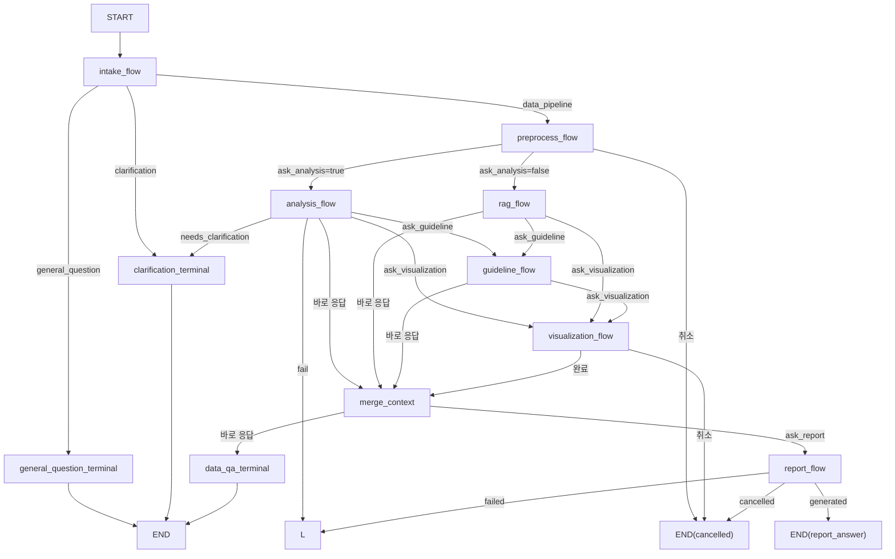

# 질문 흐름

이 문서는 사용자 질문이 메인 워크플로우 안에서 어떤 순서로 처리되는지를 설명한다. 현재 브랜치의 실제 런타임 분기 기준 코드는 `backend/app/orchestration/builder.py`와 `backend/app/orchestration/intake_router.py`다.

## 관련 노트

- [[architecture/README|아키텍처 문서 안내]]
- [[architecture/shared-state|공유 상태]]
- [[architecture/components/main-workflow|메인 워크플로우 컴포넌트]]
- [[architecture/components/analysis|Analysis 컴포넌트]]
- [[architecture/components/rag|RAG 컴포넌트]]
- [[architecture/components/visualization|Visualization 컴포넌트]]
- [[architecture/components/report|Report 컴포넌트]]
- [[architecture/ai-agent/backend-accuracy-audit|선택 데이터셋 질문 정확성 감사]]

## 상위 흐름

메인 워크플로우는 질문을 받은 뒤 dataset 선택 여부를 확인한다. dataset이 없으면 intake 단계에서 `general_question` 또는 `clarification`으로 분기한다. dataset이 있으면 별도의 `planner` node 없이 intake의 coarse intent 결과를 `handoff`로 저장한 뒤, `preprocess -> analysis 또는 rag -> guideline/visualization(optional) -> merge_context -> data_qa 또는 report` 순서로 진행한다.

## 단계별 설명

### 1. 질문 진입

- workflow는 `START`에서 시작한다.
- `intake_flow`는 `source_id`가 비어 있는지 여부를 확인한 뒤 no-dataset planner를 태운다.
- dataset이 없으면 일반 질문 경로로 바로 이동하지 않고, 질문이 dataset 없이 답변 가능한지 먼저 분류한다.
- dataset이 있으면 이후 dataset 기반 파이프라인으로 들어간다.

### 2. intake와 handoff 준비

- `intake_flow`는 `source_id` 존재 여부를 먼저 보고 no-dataset / dataset-selected를 나눈다.
- no-dataset이면 `general_question` 또는 `clarification`으로 끝난다.
- dataset-selected면 `analyze_intent(...)` 결과를 바탕으로 `handoff.next_step = "data_pipeline"`과 `ask_preprocess`, `ask_analysis`, `ask_visualization`, `ask_report`, `ask_guideline` 플래그를 만든다.

### 3. preprocess 선행 경로

현재 브랜치에서는 selected-dataset 질문이 메인 그래프에서 항상 `preprocess_flow`를 먼저 지난다.

- `preprocess_decision`이 `run_preprocess`면 approval/revise/cancel을 거친다.
- skip이면 바로 다음 단계로 넘어간다.
- 메인 그래프는 preprocess 이후 `handoff.ask_analysis`를 보고 `analysis_flow` 또는 `rag_flow`를 결정한다.

### 4. analysis 경로

analysis 서브그래프는 질문 해석, column grounding, plan draft 생성, 최종 `AnalysisPlan` 확정, 코드 생성/실행/검증/저장을 담당한다.

- clarification이 필요하면 `clarification_terminal`
- 실패하면 `END(fail)`
- 성공하면 `ask_guideline`, `ask_visualization` 플래그를 보고 `guideline_flow`, `visualization_flow`, `merge_context`로 이동한다.

### 5. retrieval QA 경로

RAG 서브그래프는 선택된 `source_id`에 대해 인덱스 확인, 검색, `insight_synthesis`를 수행한다.

- `ask_guideline=true`면 `guideline_flow`
- `ask_visualization=true`면 `visualization_flow`
- 둘 다 아니면 `merge_context`

### 6. guideline 경로

- guideline 서브그래프는 활성 guideline이 있을 때만 검색과 evidence summary를 만든다.
- 현재 브랜치에서는 guideline이 planner 이전 입력이 아니라 analysis/rag 이후의 optional 보조 단계다.

### 7. visualization 경로

visualization 서브그래프는 차트 planning, approval, 결과 생성/finalize를 담당한다.

- 취소되면 `END(cancelled)`
- 성공하면 `merge_context`로 이동한다.

### 8. merge_context와 최종 응답

- `merge_context`는 `handoff`, `preprocess_result`, `rag_result`, `guideline_result`, `insight`, `analysis_plan`, `analysis_result`, `visualization_result`를 누적한다.
- 현재 브랜치의 `data_qa_terminal`은 별도 `answer_context`를 만들지 않고 `merged_context`를 그대로 `answer_data_question(...)`에 넘긴다.
- `ask_report=true`면 report 서브그래프로 이동한다.
- 그렇지 않으면 `data_qa_terminal`이 최종 데이터 응답을 만든다.

### 9. report 경로

report 서브그래프는 report context 준비, draft 생성, approval/revision, finalize를 담당한다.

- 취소되면 `END(cancelled)`
- 실패하면 `END(fail)`
- 성공하면 `output.type="report_answer"`를 만들고 종료한다.

## 종료 상태

- `general_question`
  - 일반 질문 응답이 바로 생성된 상태
- `clarification`
  - 추가 입력이 필요한 상태
- `data_qa`
  - `merged_context` 기반의 최종 데이터 응답이 생성된 상태
- `report_answer`
  - 리포트 응답이 생성된 상태
- `fail`
  - planning, preprocess, analysis, report 등에서 실패한 상태
- `cancelled`
  - approval 단계에서 사용자가 취소한 상태

## 최종 응답 생성 위치

- `general_question_terminal`
  - 일반 응답 생성
- `clarification_terminal`
  - clarification 질문 반환
- `data_qa_terminal`
  - `merged_context` 기반 최종 데이터 응답 생성
- `report_flow`
  - `report_answer` 생성 후 종료
