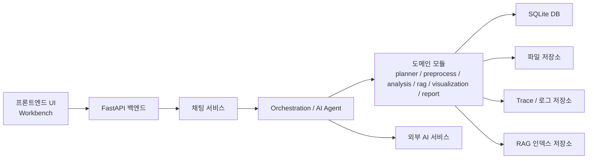

# 시스템 아키텍처

## 문서 목적

이 문서는 프론트엔드, 백엔드, AI Agent, 저장소의 전체 연결 구조를 설명한다.
현재 기준의 시스템 구성 요소와 연결 관계를 기준으로 정리하며, 기획, 프론트엔드, 백엔드가 함께 참고할 수 있도록 쉬운 언어로 설명한다.

## 아키텍처 개요

현재 시스템은 크게 아래 구성 요소로 나뉜다.

- 프론트엔드 UI
- FastAPI 백엔드
- Orchestration / AI Agent
- 도메인 모듈
- 저장소
- 외부 AI 의존성

사용자는 프론트엔드에서 질문과 승인 요청을 주고받고, 프론트엔드는 이를 FastAPI 백엔드에 전달한다.
백엔드는 채팅 API를 통해 실행을 시작하고, 내부의 Orchestration 계층이 planner, 전처리, 분석, RAG, 시각화, 리포트 흐름을 조합한다.
이 과정에서 데이터는 DB, 파일 저장소, 로그 저장소, RAG 인덱스 저장소에 나뉘어 관리된다.

## 주요 구성 요소

### 1. 프론트엔드

프론트엔드는 Workbench 중심의 웹 UI로 구성된다.
사용자는 여기서 데이터를 선택하거나 업로드하고, 질문을 입력하고, 승인 요청에 응답하고, 최종 결과를 확인한다.

즉, 프론트엔드는 단순 입력창이 아니라 질문, 승인, 결과 렌더링을 모두 담당하는 사용자 진입점이다.

### 2. FastAPI 백엔드

백엔드는 FastAPI를 기반으로 동작하며, 채팅, 데이터셋, 분석, 전처리, 시각화, 지침서와 같은 API 진입점을 제공한다.
이 계층은 외부 요청을 받아 내부 서비스와 워크플로우로 연결하는 역할을 한다.

### 3. 채팅 서비스

채팅 서비스는 세션과 메시지 저장, 실행 시작, 승인 이후 재개를 함께 담당한다.
사용자 요청이 실제 AI 실행 흐름으로 들어가는 대표 진입점은 채팅 API이며, 채팅 서비스가 Agent 실행과 저장 책임을 연결한다.

### 4. Orchestration / AI Agent

Orchestration 계층은 질문을 실제 workflow로 실행하는 중심 계층이다.
이 계층은 질문 분기, planner 판단, 전처리, 분석, RAG, 시각화, 리포트 흐름을 조합하여 하나의 실행 경로를 만든다.

즉, AI Agent는 단일 모델 호출이 아니라 여러 도메인 모듈을 연결해 하나의 분석 경험으로 조합하는 역할을 가진다.

### 5. 도메인 모듈

도메인 모듈은 실제 업무 기능을 담당한다.
현재 시스템에는 아래와 같은 주요 모듈이 있다.

- datasets
- analysis
- preprocess
- rag
- guidelines
- visualization
- reports

각 모듈은 자신의 책임 범위 안에서 데이터 처리, 분석 실행, 결과 생성, 저장 연동을 수행한다.

### 6. 저장소

시스템은 하나의 저장소만 사용하는 구조가 아니라, 목적에 따라 저장 위치가 나뉜다.

- SQLite DB
- 업로드 및 전처리 결과 파일 저장소
- trace / 로그 저장소
- RAG 인덱스 저장소

### 7. 외부 AI 의존성

외부 AI 의존성은 주로 LLM 호출과 임베딩/벡터 검색 관련 기능에 사용된다.
시스템은 이 외부 기능을 직접 사용자에게 노출하지 않고, 내부 workflow 안에서 분석 보조 기능으로 사용한다.

## 계층별 역할

### 프론트엔드 계층

프론트엔드 계층은 질문 입력, 데이터 업로드, 승인 응답, 결과 렌더링을 담당한다.
사용자 관점의 대부분의 인터랙션은 이 계층에서 시작된다.

### API 계층

API 계층은 HTTP와 SSE 기반 진입점을 제공한다.
질문 시작, 승인 이후 재개, 데이터셋 업로드와 조회 같은 요청을 받아 내부 서비스로 전달한다.

### 오케스트레이션 계층

오케스트레이션 계층은 질문 분기와 실행 순서를 결정한다.
planner 판단을 바탕으로 어떤 workflow를 타야 하는지 정하고, 필요한 모듈을 연결해 실제 실행을 조합한다.

### 도메인 서비스 계층

도메인 서비스 계층은 데이터셋 처리, 전처리, 분석, 시각화, 리포트, RAG와 같은 기능을 실제로 수행한다.
즉, 시스템의 기능적 책임은 이 계층에 모여 있다.

### 저장 계층

저장 계층은 세션/메시지/메타데이터의 DB 저장, CSV 등의 파일 저장, trace/log 저장, 벡터 인덱스 저장을 담당한다.
하나의 계층이지만 저장 대상에 따라 물리적 위치는 나뉘어 있다.

## 주요 연결 관계

프론트엔드는 채팅 API와 데이터셋 API를 호출해 백엔드와 통신한다.
채팅 API는 ChatService를 통해 AgentClient와 연결되고, AgentClient는 main workflow를 실행한다.

main workflow는 planner, preprocess, analysis, rag, guideline, visualization, report를 상황에 맞게 조합한다.
즉, 도메인 모듈들이 각각 독립적으로 존재하지만, 실제 사용자 경험은 orchestration 계층에서 하나의 실행 흐름으로 묶인다.

datasets 모듈은 파일 저장과 DB row 관리를 함께 담당한다.
RAG는 dataset과 guideline 데이터에 연결되지만, 일반 데이터 저장과는 별도로 인덱스를 저장한다.
trace logging은 실행 전반에서 공통적으로 사용되며, 각 단계의 상태를 남기는 용도로 연결된다.

## 데이터와 저장 구조

현재 기본 DB는 SQLite `app.db`다.
세션, 메시지, 데이터셋 메타데이터와 같은 구조화된 정보는 DB에 저장된다.

데이터셋 원본 파일과 전처리 결과 파일은 파일 저장소에 저장된다.
즉, 데이터 자체와 데이터 메타정보는 같은 곳에 저장되지 않는다.

trace와 로그는 `storage/logs` 계열에 저장된다.
RAG 인덱스 역시 일반 데이터 파일과는 별도의 저장 위치를 사용한다.

이 문서에서는 데이터가 어디에 저장되는지까지만 설명하고, 상세 스키마와 데이터 모델은 `Data` 문서에서 별도로 다룬다.

## 외부 의존성

시스템은 외부 AI 기능에 의존한다.
대표적으로 아래 역할이 있다.

- LLM 호출
- 임베딩 생성
- 벡터 기반 검색

이 의존성들은 제품 외부에 있지만, 시스템 내부에서는 planner, 분석 보조, RAG 처리 같은 기능을 지원하는 기반 요소로 작동한다.

## 이 문서를 읽는 방법

이 문서는 시스템의 구성 요소와 연결 관계를 설명하는 문서다.
질문이 시간 순서대로 어떻게 처리되는지 보고 싶다면 `시스템 플로우 개요`를 먼저 보는 것이 맞다.

이후 세부 문서는 아래 순서로 이어서 읽는 것이 자연스럽다.

- 시스템 플로우 개요: 실행 흐름
- 시스템 아키텍처: 전체 구성 요소와 연결 관계
- 백엔드 구조: 백엔드 모듈 중심 설명
- 프론트엔드 구조: 화면과 UI 중심 설명
- API 개요 및 명세: 요청 단위 설명
