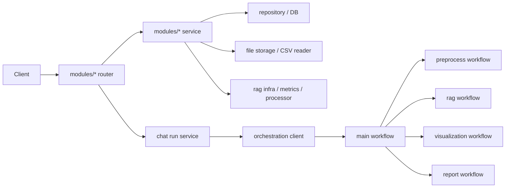

# 백엔드 데이터 흐름 설계서

## 1. 목적

- 이 문서는 현재 코드 기준의 실제 데이터 흐름을 기록한다.
- 구조가 `modules + orchestration + core`로 정리된 이후 기준 문서다.
- 목적은 구조 변경 중에도 아래 계약을 유지하는 것이다.
  - 어떤 요청이 어디로 들어가는가
  - 어떤 식별자가 어디서 이어지는가
  - 어떤 저장소에 무엇이 기록되는가

## 2. 공통 식별자

- `dataset_id`
  - `datasets.id`
- `source_id`
  - 데이터셋 외부 식별자
  - datasets / preprocess / visualization / chat / rag를 잇는 공통 키
- `session_id`
  - `chat_sessions.id`
- `run_id`
  - agent 실행 단위 식별자
- `report_id`
  - `reports.id`
- `result_id`
  - `analysis_results` export 대상 식별자

## 3. 저장 위치

파일 저장소

- 업로드 파일: `storage/datasets/*`
- 벡터 인덱스: `storage/vectors/{source_id}/index.faiss`

DB

- `datasets`
- `chat_sessions`
- `chat_messages`
- `reports`
- `rag_sources`
- `rag_chunks`
- `rag_context`
- `analysis_results`
- `chart_results`
- `view_snapshots`

## 4. 전체 개요

## 5. datasets 흐름

### 5.1 업로드

진입점

- [modules/datasets/router.py](/Users/anjeongseob/Desktop/Project/capstone-project/backend/app/modules/datasets/router.py)
- `POST /datasets/`

실행 순서

1. router가 업로드 파일과 display name을 받는다.
2. `DataSourceService.upload_dataset(...)`를 호출한다.
3. service가 `storage.persist_file(...)`로 파일을 `storage/datasets`에 저장한다.
4. service가 `repository.create(...)`로 `datasets` row를 만든다.
5. service가 내부적으로 `rag_service.index_dataset(dataset)`를 호출한다.
6. rag service가 텍스트를 읽고 청킹한 뒤 임베딩과 FAISS 인덱스를 만든다.
7. `rag_sources`, `rag_chunks`를 기록한다.
8. router는 `DatasetBase`로 응답한다.

유지해야 할 의미 계약

- 순서는 항상 `파일 저장 -> datasets row 생성 -> RAG 인덱싱`이다.
- 임베딩 실패 시 dataset 파일과 row는 이미 생성된 상태일 수 있다.

### 5.2 목록/상세/샘플

- 목록: `GET /datasets/`
- 상세: `GET /datasets/{dataset_id}`
- 샘플: `GET /datasets/{source_id}/sample`

현재 모두 `modules/datasets/service.py`가 소유한다.

### 5.3 삭제

진입점

- `DELETE /datasets/{source_id}`

실행 순서

1. service가 dataset 메타데이터를 조회한다.
2. 파일을 삭제한다.
3. dataset row를 삭제한다.
4. 내부적으로 `rag_service.delete_source(source_id)`를 best-effort로 호출한다.
5. router는 `204`를 반환한다.

유지해야 할 의미 계약

- dataset 삭제 후 RAG cleanup은 따라오지만, cleanup 실패가 dataset 삭제를 롤백하지는 않는다.

## 6. chat 흐름

### 6.1 단건 질의

진입점

- [modules/chat/router.py](/Users/anjeongseob/Desktop/Project/capstone-project/backend/app/modules/chat/router.py)
- `POST /chats/`

실행 순서

1. router가 `ChatRequest`를 받는다.
2. `ChatService.ask(...)`를 호출한다.
3. 내부적으로 `ask_stream()`을 끝까지 소비한다.
4. `approval_required`가 먼저 오면 pending approval 포함 응답을 반환한다.
5. `done`이 오면 최종 answer를 반환한다.

### 6.2 스트리밍 질의

진입점

- `POST /chats/stream`

실행 순서

1. `ChatSessionService`가 session을 조회하거나 새로 만든다.
2. source_id가 있으면 dataset을 조회한다.
3. user message를 저장한다.
4. `run_id`를 생성한다.
5. `session` SSE 이벤트를 먼저 보낸다.
6. `ChatRunService`가 `AgentClient.astream_with_trace(...)`를 호출한다.
7. agent 이벤트를 SSE event로 relay한다.
8. 완료 시 assistant message를 저장한다.

유지해야 할 SSE 이름

- `session`
- `thought`
- `chunk`
- `approval_required`
- `done`
- `error`

### 6.3 resume / pending approval / history / delete

- `POST /chats/{session_id}/runs/{run_id}/resume`
- `GET /chats/{session_id}/runs/{run_id}/pending-approval`
- `GET /chats/{session_id}/history`
- `DELETE /chats/{session_id}`

이 흐름은 각각 `ChatRunService`, `ChatSessionService`가 나눠 소유한다.

## 7. orchestration 메인 흐름

구현 위치

- [orchestration/client.py](/Users/anjeongseob/Desktop/Project/capstone-project/backend/app/orchestration/client.py)
- [orchestration/builder.py](/Users/anjeongseob/Desktop/Project/capstone-project/backend/app/orchestration/builder.py)

현재 조합 순서

1. intake
2. preprocess
3. rag
4. visualization
5. merge_context
6. report 또는 data QA

중요 점

- builder는 raw DB가 아니라 조립된 module service를 workflow에 주입한다.
- workflow는 cross-module 흐름만 관리한다.
- CSV 읽기, vector indexing, 시각화 실행, metrics 계산 같은 세부 구현은 각 module service가 소유한다.

## 8. preprocess direct API

진입점

- [modules/preprocess/router.py](/Users/anjeongseob/Desktop/Project/capstone-project/backend/app/modules/preprocess/router.py)
- `POST /preprocess/apply`

실행 순서

1. router가 요청을 받는다.
2. preprocess service가 input dataset을 조회한다.
3. reader로 CSV를 읽는다.
4. processor가 operation을 적용한다.
5. 결과 CSV를 저장한다.
6. 새 dataset row를 만든다.
7. `input_source_id`, `output_source_id`, `output_filename`을 반환한다.

유지해야 할 계약

- direct preprocess는 새 dataset만 만들고 자동 RAG 재인덱싱은 하지 않는다.

## 9. visualization direct API

진입점

- [modules/visualization/router.py](/Users/anjeongseob/Desktop/Project/capstone-project/backend/app/modules/visualization/router.py)
- `POST /vizualization/manual`

실행 순서

1. router가 manual visualization 요청을 받는다.
2. visualization service가 `source_id` 기준으로 dataset을 조회한다.
3. 요청 컬럼만 읽어 row 데이터를 구성한다.
4. 차트 데이터 payload를 반환한다.

유지해야 할 계약

- 수동 시각화는 datasets가 아니라 visualization 모듈이 소유한다.
- join key는 계속 `source_id`다.

## 10. rag direct API

진입점

- [modules/rag/router.py](/Users/anjeongseob/Desktop/Project/capstone-project/backend/app/modules/rag/router.py)
- `POST /rag/query`
- `DELETE /rag/sources/{source_id}`

실행 순서

1. router가 request를 받는다.
2. `RagService.answer_query(...)`를 호출한다.
3. service가 retrieval을 수행한다.
4. 검색 결과가 없으면 `204 No Content`
5. 검색 결과가 있으면 shared agent를 이용해 answer를 합성한다.
6. `answer`, `retrieved_chunks`, `executed_at`을 반환한다.

의도적으로 유지한 현행 제약

- direct `/rag/query`가 전달하는 `context`는 현재 answer generation에서 의미 있게 반영되지 않는다.

## 11. report direct API

진입점

- [modules/reports/router.py](/Users/anjeongseob/Desktop/Project/capstone-project/backend/app/modules/reports/router.py)
- `POST /report/`
- `GET /report/`
- `GET /report/{report_id}`

생성 흐름

1. router가 request를 받는다.
2. `ReportService.create_report_from_request(...)`를 호출한다.
3. service가 shared agent로 summary를 생성한다.
4. service가 `reports` row를 저장한다.
5. `report_id`, `session_id`, `summary_text`를 반환한다.

의도적으로 유지한 현행 제약

- direct `/report`도 `context` semantics를 의미 있게 쓰지 않는다.

## 12. export API

진입점

- [modules/export/router.py](/Users/anjeongseob/Desktop/Project/capstone-project/backend/app/modules/export/router.py)
- `POST /export/csv`

실행 순서

1. router가 `result_id`를 받는다.
2. export service가 `analysis_results`를 조회한다.
3. CSV bytes와 filename을 만든다.
4. router가 `StreamingResponse`로 감싼다.

유지해야 할 계약

- export는 계속 `analysis_results` 기반이다.
