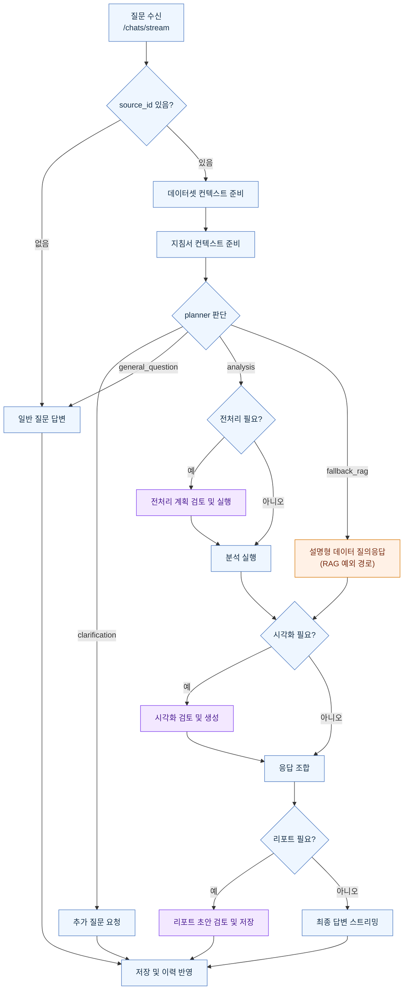

# 백엔드 시스템 플로우 개요

사용자의 질문은 채팅 API를 통해 백엔드로 들어오고, 데이터셋 선택 여부와 질문 성격에 따라 서로 다른 처리 경로를 탄다.  
데이터셋이 선택된 경우에는 데이터 구조와 지침서 근거를 먼저 준비한 뒤, planner가 분석, 설명형 질의응답, 전처리, 시각화, 리포트 필요 여부를 판단한다.  
전처리, 시각화, 리포트는 필요 시 사용자 승인 단계를 거쳐 진행되며, 최종 답변과 생성 결과는 채팅 이력과 결과 저장소에 반영된다.

## 한눈에 보는 흐름

## 읽는 포인트

- `기본 경로`: 데이터셋 기반 질문은 보통 `planner -> analysis` 경로로 진행된다.
- `예외 경로`: 데이터셋 설명, 컬럼 소개, 샘플 확인처럼 설명형 질문은 `fallback_rag` 경로로 갈 수 있다.
- `승인 필요 단계`: 전처리, 시각화, 리포트는 필요 시 사용자 검토와 승인 후 실행된다.
- `최종 답변`과 `리포트`는 같은 것이 아니다. 최종 답변은 채팅 응답이고, 리포트는 별도 초안/저장 산출물이다.
- `지침서 컨텍스트`는 답변을 만들기 전, 내부 가이드라인을 참고하기 위한 배경 정보다.

## 단계별 설명

| 단계 | 이 단계의 역할 | 언제 활성화되는가 | 관련 모듈 | 다음으로 연결되는 단계 | 사용자/프론트에서 보이는 결과 |
| --- | --- | --- | --- | --- | --- |
| 1. 요청 수신과 세션 시작 | 질문을 받아 실행 단위를 만들고 스트리밍 응답을 시작한다. 입력: 질문, `session_id`, `source_id`, `model_id` 출력: 세션/런 정보, 스트리밍 이벤트 | `/chats/stream`, `/chats/{session_id}/runs/{run_id}/resume` 호출 시 항상 활성화 | `backend/app/modules/chat`, `backend/app/orchestration/client.py` | 질문 분기 | 질문을 보내면 응답이 스트리밍으로 오고, 필요하면 승인 요청도 중간에 받을 수 있다. |
| 2. 질문 분기 | 데이터셋 선택 여부를 먼저 확인해 일반 질문과 데이터 기반 질문을 나눈다. 입력: `source_id` 유무 출력: 일반 질문 경로 또는 데이터셋 기반 경로 | 모든 요청에서 항상 실행 | `backend/app/orchestration/intake_router.py` | 일반 질문 답변 또는 데이터/지침 컨텍스트 준비 | 데이터를 붙였는지 여부에 따라 시스템이 완전히 다른 처리 방식을 선택한다. |
| 3. 데이터/지침 컨텍스트 준비 | 선택된 데이터셋의 구조 요약과, 활성 지침서의 관련 근거를 준비한다. 입력: 선택된 데이터셋, 활성 지침서, 사용자 질문 출력: `dataset_context`, `guideline_context` | 데이터셋 기반 경로일 때 활성화 | `backend/app/modules/profiling`, `backend/app/orchestration/workflows/guideline.py`, `backend/app/modules/guidelines`, `backend/app/modules/rag` | planner 판단 | 답변을 바로 만들지 않고, 먼저 데이터 구조와 내부 가이드를 확인한다. |
| 4. planner 판단 | 이 질문을 분석으로 풀지, 설명형 질의응답으로 풀지, 전처리/시각화/리포트가 필요한지 결정한다. 입력: 질문, 요청 문맥, `dataset_context`, `guideline_context` 출력: 경로 결정, 전처리 필요 여부, 추가 질문 여부 | 데이터셋 및 지침 컨텍스트 준비 후 활성화 | `backend/app/modules/planner` | 일반 질문, 추가 질문, 전처리, 분석, RAG 예외 경로 | 시스템이 “어떤 처리 경로를 탈지” 정하는 단계다. 기본 경로는 `analysis`, 예외 경로는 `fallback_rag`다. |
| 5. 전처리 | 분석 전에 데이터 정리나 변환이 필요하면 계획을 만들고 승인 후 실행한다. 입력: planner 결과, 데이터 프로필, EDA 기반 추천 출력: 전처리 계획, 전처리 결과, 필요 시 새 데이터셋 산출물 | planner가 `preprocess_required=true`로 판단했을 때만 활성화 | `backend/app/orchestration/workflows/preprocess.py`, `backend/app/modules/preprocess`, `backend/app/modules/eda` | 분석 | 전처리가 필요하면 먼저 계획을 보여주고, 승인/수정/취소를 받는다. 전처리가 필요 없으면 이 단계는 생략된다. |
| 6. 분석 또는 설명형 질의응답 | 정량 질문은 코드 생성/실행 기반 분석으로 답하고, 설명형 데이터 질문은 RAG 기반 질의응답으로 답한다. 입력: planner 결과, 질문, 데이터셋 또는 검색 컨텍스트 출력: `analysis_result` 또는 `rag_result`/`insight` | planner가 `analysis` 또는 `fallback_rag`를 선택할 때 활성화 | 분석: `backend/app/orchestration/workflows/analysis.py`, `backend/app/modules/analysis` 설명형 질의응답: `backend/app/orchestration/workflows/rag.py`, `backend/app/modules/rag` | 시각화 또는 응답 조합 | 숫자를 계산해 답할지, 자료를 찾아 설명할지 여기서 갈린다. 분석은 필요 시 추가 확인 질문을 다시 던질 수 있다. |
| 7. 시각화 | 분석 결과나 요청 의도에 맞는 차트/그래프를 만들고, 필요하면 검토 후 생성한다. 입력: `analysis_result`, `analysis_plan`, 또는 데이터셋 기반 시각화 요청 출력: `visualization_result` | planner 또는 후속 상태에서 시각화가 필요하다고 판단될 때 활성화 | `backend/app/orchestration/workflows/visualization.py`, `backend/app/modules/visualization` | 응답 조합 | 차트가 필요하면 검토/수정/취소가 가능한 인터랙션이 열리고, 승인 후 생성된다. |
| 8. 최종 응답 조합 | 지금까지 만든 컨텍스트와 결과를 모아 최종 채팅 답변을 작성한다. 입력: `dataset_context`, `guideline_context`, 전처리 결과, 분석 결과, RAG 결과, 시각화 결과 출력: 최종 답변 텍스트 | 분석/RAG/시각화 단계가 끝난 뒤 활성화 | `backend/app/orchestration/state_view.py`, `backend/app/orchestration/ai.py` | 리포트 또는 최종 답변 종료 | 시스템이 중간 산출물을 종합해 최종 답변을 작성한다. 이 단계의 결과는 채팅 응답이며, 리포트와는 별개다. |
| 9. 리포트와 결과 저장 | 리포트가 필요하면 초안을 만들고 승인 후 저장하며, 동시에 채팅 이력과 분석 결과를 남긴다. 입력: `analysis_result`, `visualization_result`, `guideline_context`, `dataset_context`, 세션 정보 출력: `report_result`, 저장된 리포트, 분석 결과 기록, 채팅 이력 | 리포트는 `need_report=true`일 때 활성화, 저장은 실행 종료 시 반영 | 리포트: `backend/app/orchestration/workflows/report.py`, `backend/app/modules/reports` 결과 저장/이력: `backend/app/modules/results`, `backend/app/modules/chat` | 종료 | 답변만 받을 수도 있고, 별도 리포트까지 만들 수도 있다. 리포트도 승인/수정/취소가 가능한 단계다. |

## 대표 시나리오

### 1. 일반 질문
- 어떤 질문인지: “오늘 환율이 어때?”처럼 데이터셋과 무관한 일반 질문
- 어떤 단계가 켜지는지: 요청 수신 -> 질문 분기 -> 일반 질문 답변
- 사용자가 무엇을 보게 되는지: 별도 분석 없이 바로 일반 답변이 스트리밍된다.

### 2. 정량 분석 질문
- 어떤 질문인지: “3월 불량률 평균을 라인별로 비교해줘”처럼 계산과 비교가 필요한 질문
- 어떤 단계가 켜지는지: 요청 수신 -> 질문 분기 -> 데이터/지침 컨텍스트 준비 -> planner -> 분석 -> 필요 시 시각화 -> 응답 조합
- 사용자가 무엇을 보게 되는지: 계산 결과 중심의 답변을 받고, 필요하면 차트도 함께 확인한다.

### 3. 설명형 데이터 질문
- 어떤 질문인지: “이 데이터셋에는 어떤 컬럼이 있어?”, “샘플 몇 줄 보여줘”처럼 설명형 질문
- 어떤 단계가 켜지는지: 요청 수신 -> 질문 분기 -> 데이터/지침 컨텍스트 준비 -> planner -> `fallback_rag` -> 응답 조합
- 사용자가 무엇을 보게 되는지: 계산보다 설명 중심의 답변을 받는다.

### 4. 시각화/리포트 요청
- 어떤 질문인지: “이 결과를 차트로 보여줘”, “보고서 형태로 정리해줘”처럼 출력 형식을 요구하는 질문
- 어떤 단계가 켜지는지: 요청 수신 -> 질문 분기 -> 컨텍스트 준비 -> planner -> 분석 -> 시각화 optional -> 응답 조합 -> 리포트 optional
- 사용자가 무엇을 보게 되는지: 시각화나 리포트 초안을 확인하고, 필요 시 승인/수정 후 최종 산출물을 받는다.

## 자주 보는 포인트

### 기본 경로
- 데이터셋이 선택된 정량 질문은 보통 `planner -> analysis` 경로로 간다.
- 시각화와 리포트는 분석 이후 필요할 때만 이어지는 선택 단계다.

### 예외 경로
- 데이터셋 설명, 컬럼 소개, 샘플 확인 같은 질문은 `fallback_rag`로 갈 수 있다.
- 질문이 모호하면 시스템은 바로 실행하지 않고 추가 질문을 먼저 보낸다.

### 승인 필요 단계
- 전처리: 데이터 변경이 일어날 수 있기 때문에 승인 단계가 있다.
- 시각화: 차트 계획이 적절한지 검토할 수 있다.
- 리포트: 초안 검토 후 저장 여부를 결정할 수 있다.

## 문서에서 사용하는 주요 용어

- 질문 진입점: `/chats/stream`
- 재개 진입점: `/chats/{session_id}/runs/{run_id}/resume`
- 데이터 선택 키: `source_id`
- 선택적 출력: `시각화`, `리포트`, `최종 답변`
- 승인 단계: `전처리`, `시각화`, `리포트`

## 향후 메모

- 현재 문서는 `현재 실제 동작` 기준으로 작성했다.
- 세부 기술 흐름과 리팩터링 방향은 `docs/analysis-agent-flow/` 아래 문서에서 별도로 관리한다.
- 이후에는 결과 저장 구조, 승인 UX, 프론트 연동 이벤트를 별도 운영 문서로 나누어 관리할 수 있다.
